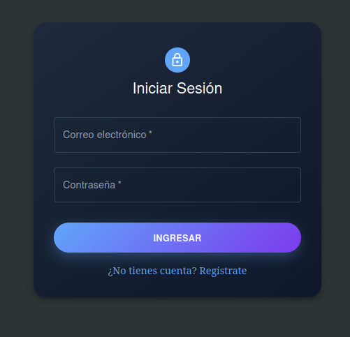
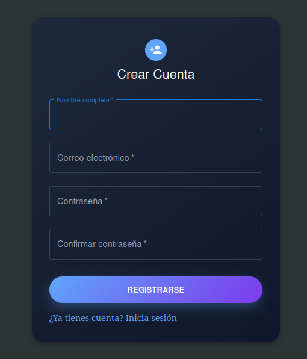
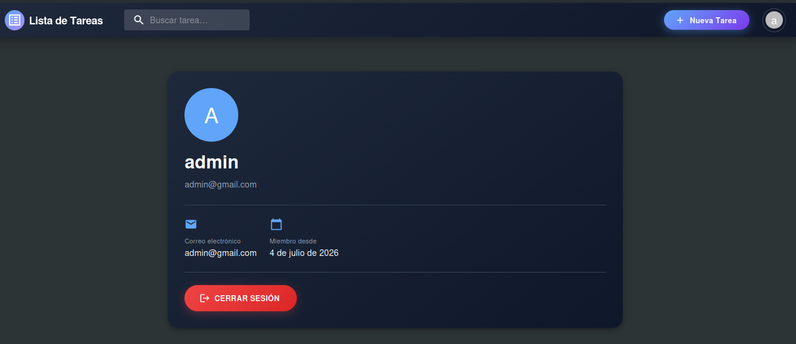
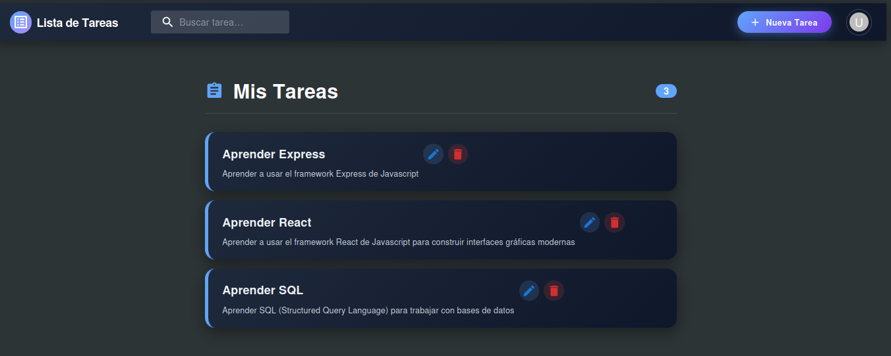
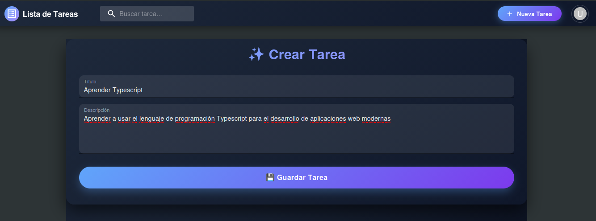
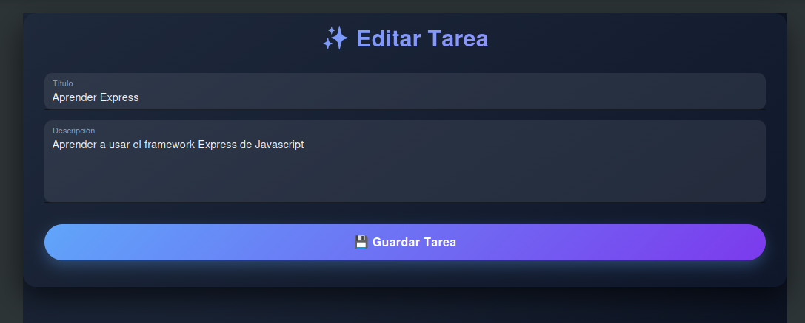
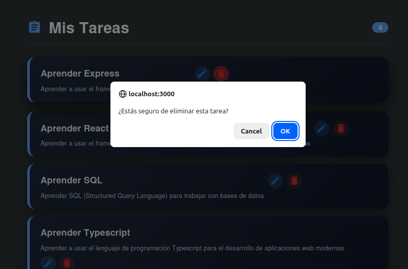
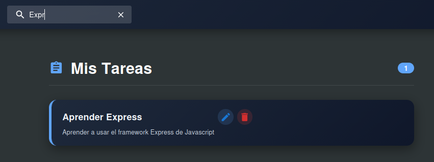

# Aplicación de lista de tareas


### Tecnologías usadas:
```
Frontend: React.js
Backend: Express.js
Database: PostgreSQL
```

### Iniciar sesión


### Registro de usuario


### Perfil de usuario


### Lista de Tareas


### Crear Tarea


### Editar Tarea


### Eliminar Tarea


### Buscar Tarea



